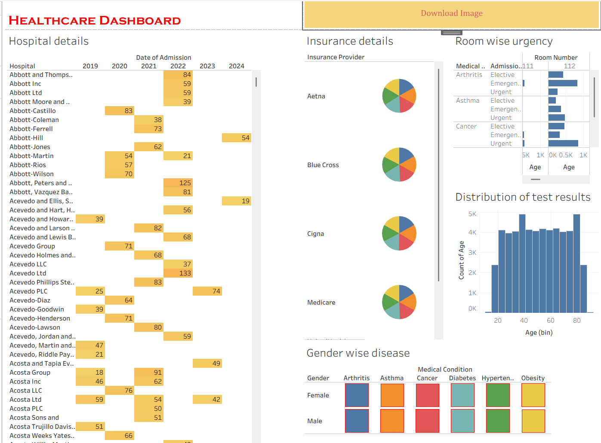

# 🏥 Healthcare Dashboard – Tableau

An interactive **Healthcare Analytics Dashboard** built using **Tableau** to explore hospital admissions, insurance providers, medical conditions, emergency cases, patient demographics, and test-result distributions.

The dashboard transforms healthcare data into an easy-to-understand visual interface that helps identify patterns across hospitals, admission years, medical conditions, insurance providers, age groups, and gender.

---

## 📊 Dashboard Preview



---

## 🎯 Project Objective

The main objective of this project is to analyze healthcare admission data and present meaningful insights through interactive visualizations.

The dashboard focuses on:

* Hospital-wise admission analysis
* Year-wise admission distribution
* Insurance provider analysis
* Room-wise emergency and admission analysis
* Age distribution of patients
* Test result distribution
* Gender-wise medical condition analysis
* Identification of patterns in patient and hospital data

---

## 📌 Dashboard Features

### 🏥 Hospital Details

The **Hospital Details** section provides a year-wise view of hospital admissions.

It allows users to examine:

* Hospitals
* Admission years
* Number of admissions/patient records
* Hospital-wise distribution across different years

The highlighted cells make it easier to identify hospitals with higher activity during particular years.

---

### 🛡️ Insurance Details

The **Insurance Details** section presents the distribution of patients across different insurance providers.

The dashboard includes providers such as:

* Aetna
* Blue Cross
* Cigna
* Medicare
* Other insurance providers

Pie charts provide a quick visual comparison of insurance-provider distributions.

---

### 🚨 Room-wise Emergency Analysis

The **Room Wise Urgency** visualization analyzes admission types across room numbers.

It provides information about:

* Medical conditions
* Admission type
* Room number
* Emergency admissions
* Urgent admissions
* Elective admissions

This helps understand how different admission types are distributed across hospital rooms.

---

### 🧪 Distribution of Test Results

The **Distribution of Test Results** section provides an age-based distribution of patient records.

The histogram helps visualize:

* Patient age ranges
* Number of patients within each age group
* Concentration of patients across different age intervals

This makes it easier to identify the dominant age groups within the dataset.

---

### 👨‍⚕️ Gender-wise Disease Analysis

The **Gender Wise Disease** visualization compares medical conditions between male and female patients.

The dashboard covers conditions such as:

* Arthritis
* Asthma
* Cancer
* Diabetes
* Hypertension
* Obesity

This visualization helps identify differences and similarities in disease distribution across genders.

---

## 🗂️ Dataset

The project uses a healthcare dataset containing patient and hospital-related information.

### Dataset Attributes

| Column             | Description                          |
| ------------------ | ------------------------------------ |
| Name               | Patient name                         |
| Age                | Patient age                          |
| Gender             | Patient gender                       |
| Blood Type         | Patient blood group                  |
| Medical Condition  | Diagnosed medical condition          |
| Date of Admission  | Patient admission date               |
| Doctor             | Treating doctor                      |
| Hospital           | Hospital associated with the patient |
| Insurance Provider | Patient's insurance provider         |
| Billing Amount     | Healthcare billing amount            |
| Room Number        | Assigned hospital room               |
| Admission Type     | Elective, Emergency, or Urgent       |
| Discharge Date     | Patient discharge date               |
| Medication         | Medication prescribed                |
| Test Results       | Patient test result                  |

---

## 🛠️ Tools & Technologies

* **Tableau** – Data visualization and dashboard development
* **CSV** – Dataset format
* **Tableau Worksheets** – Individual visualizations
* **Tableau Dashboard** – Combined interactive dashboard

---

## 📈 Visualizations Used

The dashboard combines multiple visualization techniques:

* Highlight Table
* Pie Charts
* Bar Charts
* Histogram
* Heatmap / Highlight Matrix
* Text Tables
* Interactive Filters and Tooltips

Each visualization is designed to answer a different healthcare-related analytical question.

---

## 🔍 Key Analytical Areas

The dashboard can be used to explore questions such as:

1. Which hospitals have more patient admissions?
2. How are admissions distributed across different years?
3. Which insurance providers cover more patients?
4. How are emergency, urgent, and elective admissions distributed?
5. Which age groups contain the highest number of patients?
6. How are medical conditions distributed between male and female patients?
7. Which medical conditions appear most frequently?
8. How are hospital rooms associated with different admission types?
9. What patterns can be observed from patient test-result distributions?

---

## 🎨 Dashboard Design

The dashboard follows a multi-section layout to keep different healthcare perspectives organized in one view.

### Main Sections

**Left Section**

* Hospital Details
* Year-wise admission analysis

**Middle Section**

* Insurance Details
* Insurance-provider distribution
* Gender-wise disease analysis

**Right Section**

* Room-wise urgency
* Age distribution
* Test-result analysis

This layout allows users to move from **hospital-level information → insurance analysis → admission patterns → patient demographics and diseases**.

---

## 🚀 How to Use

### 1. Download the Project

Clone this repository:

```bash
git clone https://github.com/<your-username>/healthcare-dashboard.git
```

### 2. Open the Tableau Workbook

Open the `.twb` Tableau workbook using Tableau Desktop.

### 3. Connect the Dataset

Make sure the healthcare CSV dataset is available at the expected location.

If Tableau asks for the data source, select the healthcare dataset CSV file.

### 4. Explore the Dashboard

Use the dashboard's interactive elements and visualizations to explore:

* Hospitals
* Admission years
* Insurance providers
* Admission types
* Rooms
* Age groups
* Medical conditions
* Gender distribution

---

## 📁 Project Structure

```text
Healthcare-Dashboard/
│
├── Healthcare Dashboard.twb
├── healthcare_dataset.csv
├── README.md
└── images/
    └── healthcare-dashboard.png
```

---

## 💡 Project Highlights

* 📊 Interactive healthcare data visualization
* 🏥 Hospital admission analysis
* 🛡️ Insurance provider analysis
* 🚨 Emergency and admission-type analysis
* 👥 Gender-wise disease comparison
* 🧪 Patient age and test-result distribution
* 📈 Year-wise hospital analysis
* 🎯 Multiple visualizations combined into a single dashboard
* 🖱️ Interactive Tableau tooltips and exploration

---

## 🎓 Learning Outcomes

Through this project, I gained practical experience in:

* Connecting datasets to Tableau
* Understanding healthcare datasets
* Creating Tableau worksheets
* Choosing appropriate visualizations
* Creating dashboards from multiple worksheets
* Working with dimensions and measures
* Creating calculated views and aggregations
* Using Tableau filters and tooltips
* Designing an organized analytical dashboard
* Presenting data-driven insights visually

---

## 🔮 Future Improvements

The dashboard can be further enhanced by adding:

* KPI cards for total patients, hospitals, billing amount, and average age
* Monthly and yearly admission trends
* Medical-condition ranking
* Billing amount analysis
* Medication analysis
* Blood-type distribution
* Doctor-wise patient analysis
* Interactive global filters
* Hospital performance comparison
* Advanced demographic analysis

---

## 👨‍💻 Author

**Amudieshwar A.G.**

B.Tech – Artificial Intelligence and Data Science

---

## ⭐ Project

If you find this project useful, consider giving the repository a ⭐ on GitHub.
